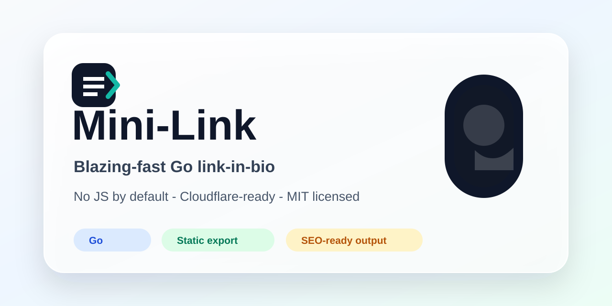

# Mini-Link

[](https://wpitombeira.com.br)

Mini-Link is a blazing-fast, self-hosted LittleLink alternative written in Go. It builds a polished link-in-bio page with no JavaScript by default, no external runtime libraries, smart caching, inline SVG icons, generated SEO files, and deployment paths for Cloudflare Workers Static Assets, Cloudflare Pages, Docker, Vercel, and any plain Go host.

Live demo: [wpitombeira.com.br](https://wpitombeira.com.br)

## Why Mini-Link

- **Fast by default**: one tiny HTML response when you use built-in or inline custom SVG icons.
- **Go standard library only**: no runtime framework, no frontend build chain, no npm dependency for the app itself.
- **SEO-ready static output**: canonical tags, Open Graph/Twitter metadata, JSON-LD, `robots.txt`, `sitemap.xml`, web manifest, favicon assets, and `llms.txt`.
- **Cloudflare-ready**: exports static assets with cache headers that work well on Workers Static Assets and Pages.
- **Configurable without code**: JSON, a small YAML subset, or `.env`.
- **Custom icon support**: built-in SVG catalog, inline custom SVG/path icons, local static assets, and optional external icon URLs.
- **MIT licensed**: open source and easy to adapt.

## Quick Start

```bash
go test ./...
go run ./cmd/minilink serve -config examples/mini-link.yaml
```

Open `http://localhost:8080`.

Build a small binary:

```bash
go build -trimpath -ldflags="-s -w" -o bin/minilink ./cmd/minilink
```

Export static files:

```bash
go run ./cmd/minilink export -config examples/mini-link.yaml -out dist
```

Deploy the exported `dist/` directory to Cloudflare Workers Static Assets, Cloudflare Pages, Vercel, Nginx, Caddy, S3-compatible hosting, or any static host.

## Configuration Formats

Use the format that fits your deployment:

- YAML: [examples/mini-link.yaml](examples/mini-link.yaml)
- JSON: [examples/mini-link.json](examples/mini-link.json)
- env file: [examples/mini-link.env.example](examples/mini-link.env.example)

More examples:

- [examples/minimal.yaml](examples/minimal.yaml)
- [examples/dropdowns.yaml](examples/dropdowns.yaml)
- [examples/dropdowns.json](examples/dropdowns.json)
- [examples/custom-icons.yaml](examples/custom-icons.yaml)
- [examples/custom-icons.json](examples/custom-icons.json)
- [examples/cloudflare/wrangler.toml](examples/cloudflare/wrangler.toml)
- [examples/cloudflare/pages.toml](examples/cloudflare/pages.toml)

See [docs/configuration.md](docs/configuration.md) for every supported field.

## Features

- Go HTTP server and static exporter
- JSON, YAML, and environment-variable configuration
- strong ETag, Last-Modified, and CDN-friendly Cache-Control headers
- immutable cache headers for exported static assets
- precompiled inline SVG icon catalog
- inline custom SVG/path icons
- local static assets and external icon URL support
- avatar image support plus export-time favicon generation
- optional S3-compatible favicon upload for S3 and Cloudflare R2
- selectable `classic`, `glass`, and `terminal` templates
- native dropdown groups without JavaScript
- optional Google Ads tag support
- generated `robots.txt`, `sitemap.xml`, `llms.txt`, and `site.webmanifest`
- Docker, Docker Compose, Cloudflare, Vercel, and manual deployment docs

## Templates

Set `template` to `classic`, `glass`, or `terminal`.

```yaml
template: glass
```

See [docs/templates.md](docs/templates.md).

## SVG Icons

Generate the browser-viewable icon guide:

```bash
go run ./cmd/minilink icons -out docs/icons.html
```

Then open `docs/icons.html`. See [docs/icons.md](docs/icons.md).

External icon URLs are supported with `icon_url`, but they add browser requests and require a looser image Content Security Policy. Use built-in icons, inline custom icons, or local static assets when performance is the priority.

## Deployment

- Docker and Docker Compose: [docs/deployment.md](docs/deployment.md)
- Manual Go build: [docs/deployment.md](docs/deployment.md)
- Cloudflare Workers Static Assets: [docs/cloudflare.md](docs/cloudflare.md)
- Cloudflare Pages: [docs/cloudflare.md](docs/cloudflare.md)
- Vercel: [docs/deployment.md](docs/deployment.md)

## Performance and SEO

Mini-Link is designed to reach 100 Lighthouse category scores when configured with local or inline assets.

```bash
go test ./...
go run ./cmd/minilink export -config examples/mini-link.yaml -out dist
go run ./cmd/minilink serve -addr :8080 -config examples/mini-link.yaml
```

Then run Lighthouse against `http://127.0.0.1:8080/` and check Performance, Accessibility, Best Practices, and SEO.

See [docs/seo.md](docs/seo.md) and [docs/github-discoverability.md](docs/github-discoverability.md).

## Suggested GitHub Metadata

Repository description:

```text
Blazing-fast, self-hosted LittleLink alternative written in Go. No JS by default, no external runtime libs, Cloudflare-ready.
```

Topics:

```text
go, link-in-bio, littlelink, cloudflare-workers, static-site-generator, self-hosted, no-javascript, seo, svg-icons, mit-license
```

Homepage:

```text
https://wpitombeira.com.br
```

Use [docs/github-social-preview.png](docs/github-social-preview.png) as the GitHub social preview image.

## License

MIT. See [LICENSE](LICENSE).
